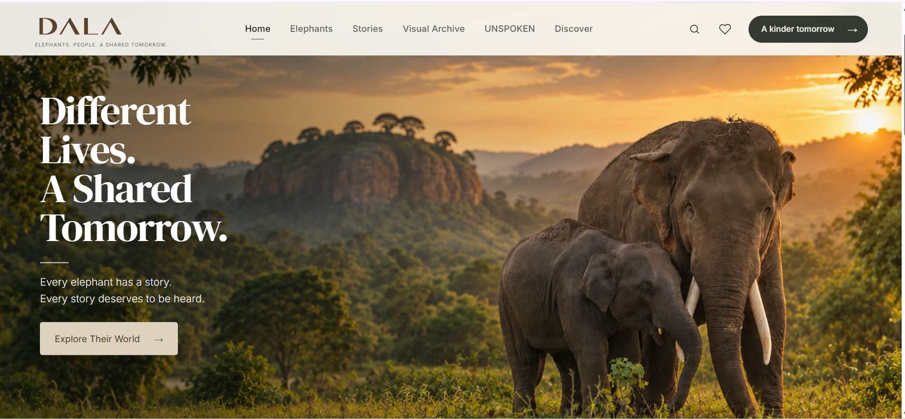
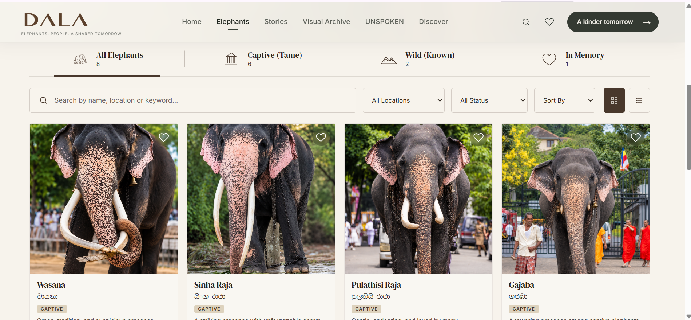
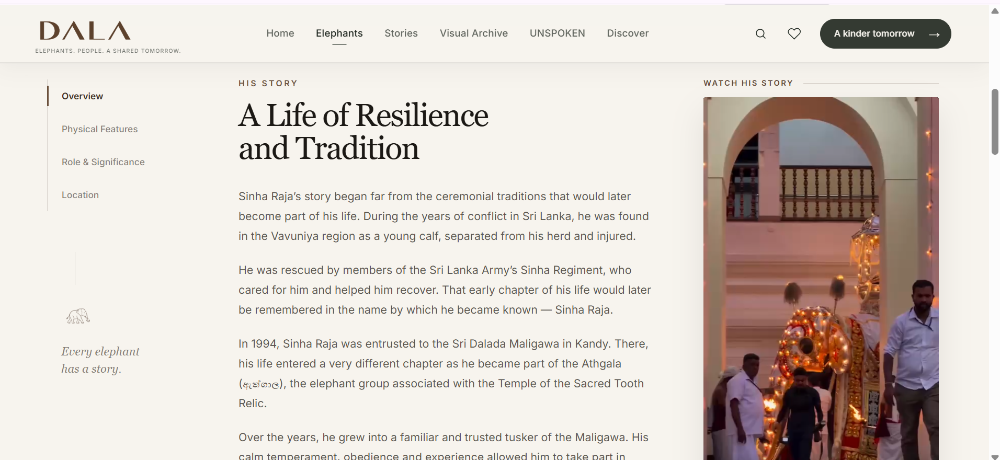
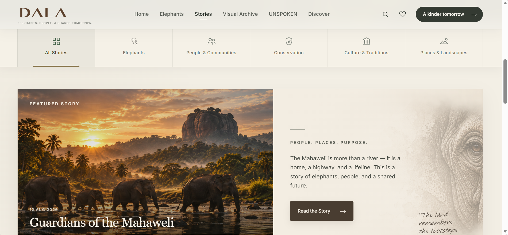
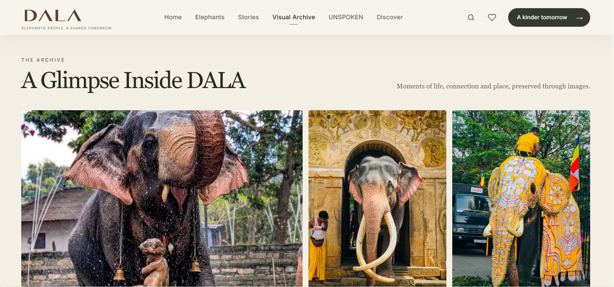
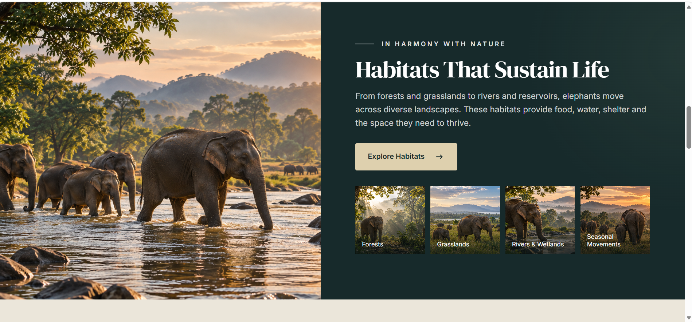
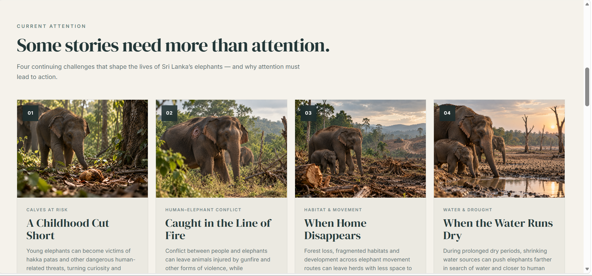

# DALA 🐘

### Elephants. People. A Shared Tomorrow.

DALA is a modern editorial web platform dedicated to the elephants of Sri Lanka — their individual stories, lives, landscapes, cultural significance, and the challenges shaping their future.

Rather than presenting elephants only as a species, DALA brings attention to them as individuals with histories, relationships, places, and stories worth preserving.

### [View Live Website](https://dala-ruby.vercel.app/)

---

## About the Project

DALA was designed and developed as a portfolio project exploring how thoughtful digital design can support storytelling, education, and awareness around Sri Lankan elephants.

The platform brings together individual elephant profiles, long-form stories, visual documentation, educational articles, cultural context, and conservation-focused content within one cohesive experience.

The visual direction follows a modern editorial approach with spacious layouts, strong photography, restrained typography, and a calm mineral-inspired colour system.

---

## Key Features

- **Elephant Index** — Browse a structured collection of Sri Lankan elephants with category, location, status, search, sorting, and viewing controls.
- **Individual Elephant Profiles** — Dedicated profile experiences documenting identity, history, physical characteristics, significance, location, and imagery.
- **Stories** — Editorial storytelling focused on elephants, people, communities, landscapes, culture, and conservation.
- **Visual Archive** — A photography-led archive preserving moments of elephant life, heritage, connection, and place.
- **UNSPOKEN** — A dedicated space drawing attention to challenges affecting elephants and the need for meaningful action.
- **Discover** — Educational content covering behaviour, habitats, communication, feeding, culture, history, and conservation.
- **Responsive Navigation** — Consistent navigation and routing across the platform.
- **Long-form Articles** — Dedicated article layouts designed for immersive educational and editorial reading.

---

## Project Preview



### Elephant Index

Search, filter, sort, and explore elephants through a structured visual index.



### Individual Stories

Profiles move beyond basic records to document the life and significance of individual elephants.



### Stories

Long-form editorial storytelling connects elephants with people, places, culture, and landscapes.



### Visual Archive

A photography-led archive preserving moments of life, connection, tradition, and place.



### Discover

Educational experiences introduce elephant habitats, behaviour, feeding, communication, culture, and more.



### UNSPOKEN

A focused editorial space for stories and challenges that need attention and action.



---

## Built With

- React
- Vite
- React Router
- JavaScript
- HTML5
- CSS3
- Git & GitHub
- Vercel

---

## Design Direction

DALA uses a modern editorial visual language rather than a traditional wildlife or heritage-site aesthetic.

The interface combines:

- Warm ivory and light stone surfaces
- Deep slate typography
- Mineral blue and muted teal accents
- Editorial serif display typography
- Clean sans-serif supporting text
- Large-scale photography
- Spacious layouts and restrained visual details
- English content with Sinhala names and terminology where culturally relevant

The goal is to create a calm, respectful digital environment where photography and storytelling remain the focus.

---

## Current Content

The current version of DALA includes:

- A curated Elephant Index
- Dedicated elephant profiles
- Editorial Stories
- A Visual Archive
- UNSPOKEN conservation-focused content
- Discover educational content
- Long-form habitat, feeding, culture, and elephant-life articles

DALA remains an evolving project, with additional elephant profiles, stories, educational material, and archive content planned for future updates.

---

## Running the Project Locally

Clone the repository:

```bash
git clone https://github.com/aanyadissanayaka/DALA.git
```

Open the project directory:

```bash
cd DALA
```

Install dependencies:

```bash
npm install
```

Start the development server:

```bash
npm run dev
```

Create a production build:

```bash
npm run build
```

---

## Live Deployment

The project is deployed with Vercel.

**Live Website:**  
https://dala-ruby.vercel.app/

---

## Project Purpose

DALA was created as a front-end portfolio project while also exploring a subject with a much broader purpose: preserving stories, encouraging curiosity, and presenting Sri Lankan elephants through a more thoughtful digital experience.

**Every elephant has a story.  
Every story deserves to be heard.**

---

## Author

**Aanya Dissanayaka**

Front-End Development · UI/UX · Web Design

---

© 2026 DALA